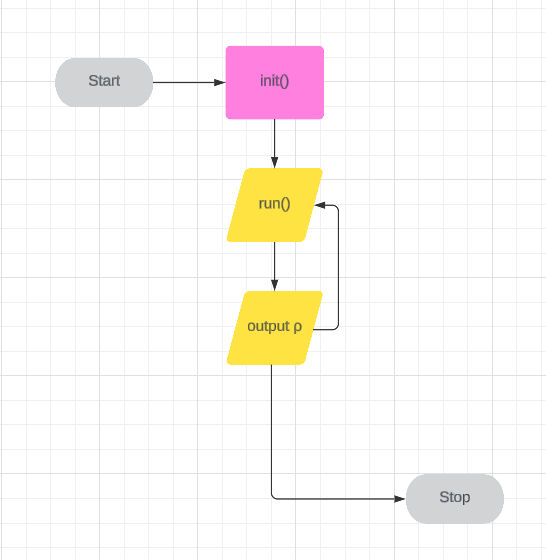

# **sysinfo**

vad det är
vad syftet är
demografin

sysinfo is a system informational command-line application that lets the user view and query different system info found on their local machine and the main purpose of the app is to help the users quickly get different important data they may need from their system, maybe straight from the command-line or piped through a different app that they are making.
The main demographic of this app would be other developers and tech interested people that want to quickly grab some data about their RAM or otherwise.

## **Table Of Contents**

1. [**Features**](#features)
3. [**UX**](#ux)
    - [Flow Chart](#flow-chart)
4. [**Testing and Validation**](#testing-and-validation)
   - [Bugs](#bugs)
     - [Validatior Testing](#validator-testing)
     - [Unfixed Bugs](#unfixed-bugs)
5. [**Deployment and Development**](#deployment-and-development)
6. [**Credits**](#credits)

## **Features**

The app features the ability for the user to select which part of system info they want to query with and then they can see data from all the available fields in that specific system info category. 
Either through the command-line arguments being passed when calling the app, or through the interactive mode that runs automatically when the user runs the app without any additional command-line arguments.
The app currently only features viewing and querying against /proc/meminfo where the intention is to add onto this functionality by letting the user pick more specifically which system info category they want to view and query.

## **UX**

### **Flow Chart**

This flowchart made with Lucidchart helped me to identify the necessary steps for my program.

## **Testing and Validation**

### **Bugs**

#### **Validator testing**

- The program was validated via the Code Institute Linter and only returned opionated errors on how code should look.

#### **Unfixed bugs**

- There are no unfixed bugs.

---

## **Deployment and Development**

This project was deployed using Heroku. The repository is stored on GitHub.

- Generate requirements for the requirements.txt file.
- Set up Heroku account.
- Click on 'Add app'
- In the setting tab, add CONFIG VAR: PORT 8000
- Add python and nodejs buildpacks, in that order.
- In the Deploy tab, connect Heroku with your GitHub account.
- Search for the relevant repository and build from Main branch (and enable automatic updates)

---

## **Credits**

- [Python](https://docs.python.org/3/)
- [LucidChart](https://lucid.app/) to design my flowchart.
- [NeoVim](https://neovim.io/) Code editor.
- [Github](https://github.com/) to store the repository.
- [Heroku](https://dashboard.heroku.com/apps) to deploy and host the App.
- Invaluable feedback from my mentor about how to better structure the project.

